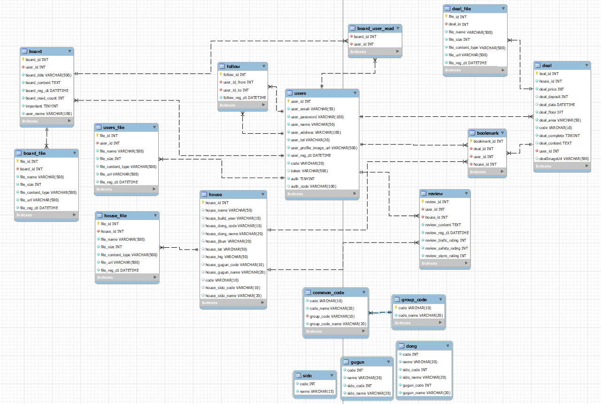
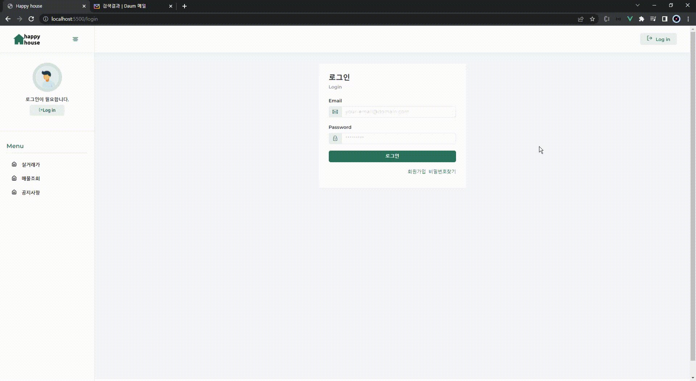
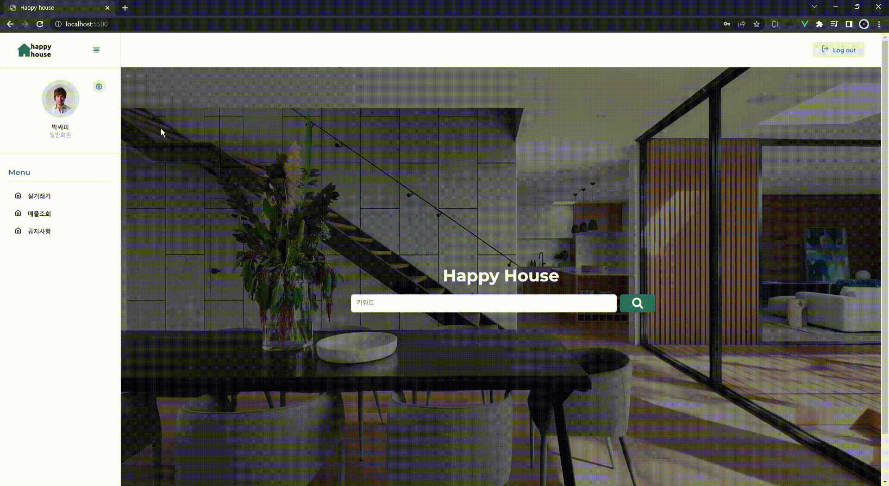
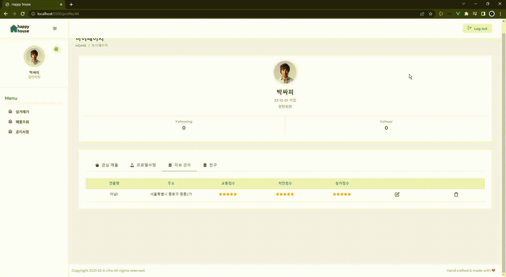

# Happy House

### 📌 삼성 청년 SW 아카데미 1학기 관통 프로젝트

 

## **개요**

✔ 공공 데이터를 활용한 서울 아파트 매매 정보 검색 사이트

  

## 프로젝트 기간

✔ 2021년 11월 16일 ~ 2021년 11월 25일

  

## 기술 스택

   
   
   
   
   
   
  

######   

## 팀원

<table>
  <thead>
    <tr>
      <th>이름</th>
      <th>역할</th>
      <th>구현 기능</th>
    </tr>
  </thead>
  <tbody>
    <tr>
      <td>서우린</td>
      <td>팀장</td>
      <td>공지사항(공지사항 등록, 수정, 삭제), 매물관리(매물등록, 수정, 삭제)</td>
    </tr>
    <tr>
      <td>박상민</td>
      <td>팀원</td>
      <td>회원관리(회원가입, 로그인, 비밀번호찾기, 회원정보수정, 팔로우, 이메일 인증), 관심매물, 리뷰, 카카오맵</td>
    </tr>
  </tbody>
</table>

  

## **DataBase 설계**

  

## 요구사항 명세서

  

## 실행 화면

### 📌 공통기능 - 실거래가 조회 메인화면

✔ 메인화면에서 키워드 또는 주소를 통해 실거래가를 조회

  

### 📌 공통기능 - 실거래가 조회 키워드

✔ 키워드를 통해 실거래가 조회

  

### 📌 공통기능 - 실거래가 조회 주소

✔ 주소를 통해 실거래가 조회

  

### 📌 공통기능 - 실거래가 조회 - 매물 상세 정보

✔ 실거래가를 조회하고 매물 리스트를 통해 매물 상세 정보를 확인할 수 있음

  

### 📌 공통기능 - 거래 매물 조회

✔ 전세, 월세, 매매 별로 매물을 조회할 수 있음 
✔ 키워드를 통해 매물을 조회할 수 있음 
✔ 매물 상세정보를 통해 매물에 대한 정보와 리뷰를 확인할 수 있고, 지도를 통해 실제 위치를 확인할 수 있음

  

### 📌 공통기능 - 회원가입

✔ 일반, 기업 회원으로 분리하여 회원가입이 가능함 
✔ 이메일 인증을 통해 사용자 인증 
✔ 입력되지 않은 항목을 표시 
✔ 중복 이메일 체크

  

### 📌 공통기능 - 비밀번호 찾기

✔ 이메일을 통해 임시 비밀번호 발송

  

### 📌 공통기능 - 프로필 수정

✔ 프로필 사진을 변경할 수 있음 
✔ 사용자 정보 (비밀번호, 주소, 전화번호) 를 수정할 수 있음

  

### 📌 공통기능 - 팔로우 

✔ 다른 사용자를 팔로우, 언팔로우 할 수 있음 
✔ 팔로우 한 사용자를 마이페이지에서 확인할 수 있음

  

### 📌 공통기능 - 공지사항 조회 

✔ 로그인한 사용자는 공지사항을 확인할 수 있음

  

---

### 📌 일반회원 - 관심매물등록 및 삭제

✔ 매물 상세 조회에서 관심매물을 등록할 수 있음 
✔ 마이페이지에서 관심매물을 확인할 수 있음 
✔ 마이페이지에서 관심매물을 삭제할 수 있음

  

### 📌 일반회원 - 리뷰 등록

✔ 매물 상세 조회에서 리뷰를 등록할 수 있음 
✔ 마이페이지에서 작성한 리뷰를 확인할 수 있음

  

### 📌 일반회원 - 리뷰 수정 및 삭제

✔ 마이페이지에서 작성한 리뷰를 수정 및 삭제할 수 있음

  

---

### 📌 기업회원 - 매물 등록

✔ 마이페이지에서 매물을 등록할 수 있음 
✔ 실제 존재하는 주소만 등록이 가능

  

### 📌 기업회원 - 매물 수정

✔ 마이페이지에서 자신이 등록한 매물을 수정할 수 있음 

  

### 📌 기업회원 - 매물 거래완료 등록 및 삭제

✔ 마이페이지에서 매물을 거래완료로 등록할 수 있음 
✔ 자신이 등록한 매물을 삭제할 수 있음

  

### 📌 관리자 - 공지사항 등록

✔ 관리자만 공지사항을 등록할 수 있음 
✔ 공지사항 등록 시 중요공지를 체크하여 중요공지로 올릴 수 있음

  

### 📌 관리자 - 공지사항 수정 및 삭제

✔ 관리자만 공지사항을 수정할 수 있음 
✔ 관리자만 공지사항을 삭제할 수 있음 
✔ 공지사항 수정 시 중요공지로 수정할 수 있음

  
